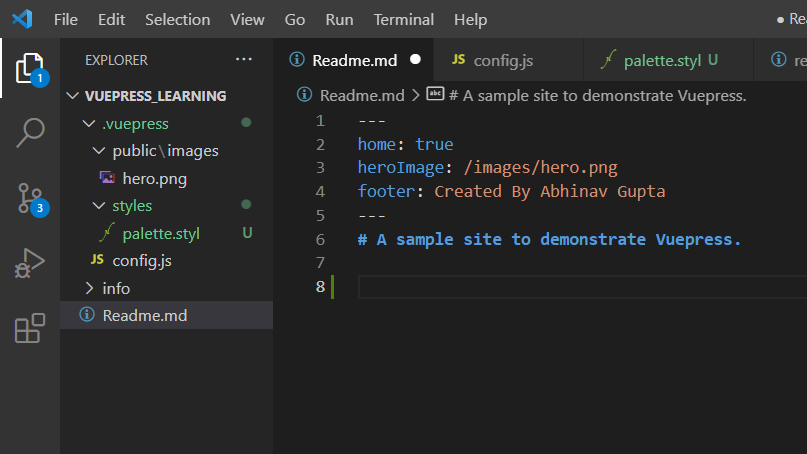
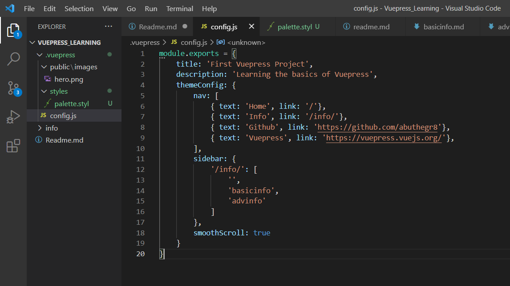
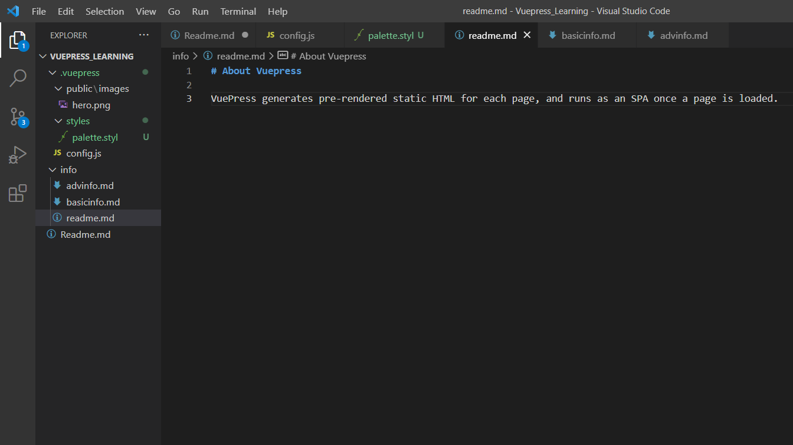
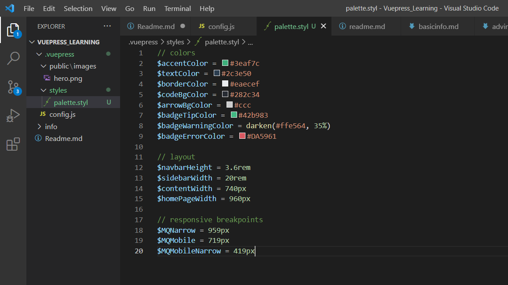

# A sample site to demonstrate Vuepress.

## About this site

This site has been written in markdown language and converted to html format using Vuepress.

### Step 1: 
A "Readme.md" file was created to contain the landing page with basic informationn and image.

### Step 2: 
A "config.js" (Node JS) file was created to add the extra elements like `sidebar` and `nav` (navigation) panels.
`smoothscroll` was set to `true`.

### Step 3:
An info folder was created with a landing page "readme.md" and two other linked pages "basicinfo.md" and "advinfo.md".
The `sidebar` edited in the "config.js" file was made to contain links to these two pages.

### Step 4:
A folder "styles" was created and "palette.styl" file was created in it to establish the themes and format of the website.

### Step 5:
The command `vuepress dev` was tested in command prompt terminal to check if the website is being able to load properly on a local host.

### Step 6:
Finally the entire project was pushed onto git.